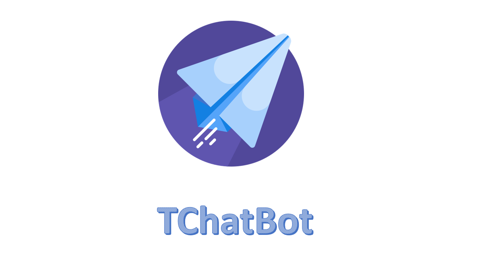

   
  

A ChatBot framework to make customizable all purpose Chatbots using NLP, Tensorflow, Speech Recognition 

# Deployment Architecture:

# Updates:
### 1. Released to `pypi` with stable release.
### 2. Will be updated to `conda` soon.

# Basic Requirements: 
- RAM > 4GB (For training the model)
- Storage Space > 200MB
- GPU RAM >=4 GB (optional)
- Python >= 3.5

# Installation:

(a). Install using `pip` 

(b). Clone the repository (dev testing)

## (a) Install Using `pip`:

# Pre-Requisites:
1. An Empty folder
2. A virtual environment (using normal python or conda python)

## Setting up the Pre-Requisites:
### 1: Create an empty folder say `Demo`.

### 2: Open the folder and open terminal from that folder location.

### 3: Create Virtual Environment
- Step 1: Either Using `virtualenv` (strictly for non-conda users, optional for conda users)
- Step 2: Or Using conda (for conda users only)

## Choose any one of the above 2 steps based on conda or non-conda users
### 1. Install virtualenv using `pip` (for both non-conda and conda users)

        pip install virtualenv==20.0.14
        
### (1.a) Run the command to create virtual environment: 

        virtualenv .

### (1.b) Activate virtual environment by running the command:
        
        .\Scripts\activate

### (1.c) `(Demo)` in the left of terminal indicates that the environment is activated

### 2. Create virtual environment (for conda users only), skip if Step 1 is done: 

        conda create -n TChatBot

### (2.a) Activate virtual environment by running the command:

        conda activate TChatBot

### (2.b) `(TChatBot)` in the left of terminal shows that the environment is activated
                 

## Install the latest `TChatBot` package using `pip`:
        
        pip install TChatBot
        
### Congrats, You installed all the required dependencies :) 

# Usage:
### (Must run within the virtual environment):

### Chat with TChatBot:

        tchatbot -chat

### Train the Chatbot:

        tchatbot -train

### Create Custom Dataset commandline

        tchatbot -create

### Check Current classes trained

        tchatbot -classes

### Check Model Pipeline Configurations

        tchatbot --config

### Check Version:
        
        tchatbot -v

### For any help/guidance regarding commands:

        tchatbot -h

# Installation for developers 
### (Must run within the virtual environment):

## (b): By Clonining this Repository ,following the steps:

### 1. Setup the Pre-Requisites as given above (without installing the `TChatBot` package)

### 2. Once done, clone the repository inside the `Demo` folder (with activated virtual environment)
#### a. Using HTTPS:

        git clone https://github.com/deepraj1729/TChatBot.git

#### b. Using SSH:

        git clone git@github.com:deepraj1729/TChatBot.git

### 3. Navigate to the `TChatBot` folder (Parent folder) command-line:
        
        cd TChatBot

### 4. Install the requirements from the activated environment:

        pip install -r requirements.txt 

## Congrats, You installed all the required dependencies :) 

# Usage (for Developers or Contributors):
### (inside the virtual environment)

### a. Chat with TChatBot:

        python main.py -chat

### b. Train the TChatbot:

        python main.py -train

### c. Create Custom Dataset command-line for retraining the Bot

        python main.py -create
    
### Check Current classes trained

        python main.py -classes

### Check Model Pipeline Configurations

        python main.py --config

### Check Version:
        
        python main.py -v

### For any help regarding commands:

        python main.py -h
